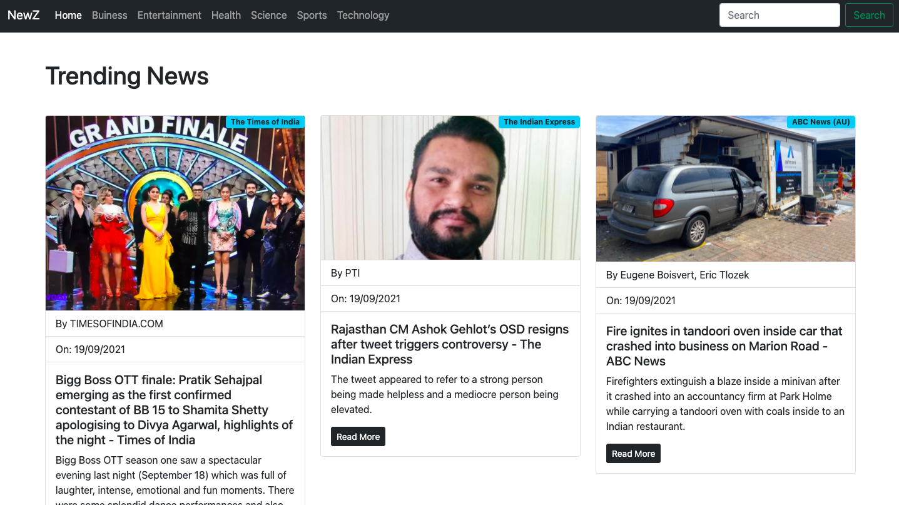

# NewZ Application     

NewZ gives you all the latest news in a short span of time, read the latest news which you want with categories you are interested in. We even provide the news which you want to know about with the search option. You won't have to change the page evrytime or wait for the page to reload as we have taken care of it.

## Installation

1.Fork the repository to your Github account with the Fork option at the top right of the screen

2.Clone the Project to your local environment by copying the url of the repositiory

`git clone`

3.Get into the project repo by

`cd NewZ`

4.Install all the dependencies using the npm packages

`npm install`

5.Get your API from the [News API](https://newsapi.org/)

`Create a .env.local file`

6.Paste the API provided in the environment variable file(.env.local)

`REACT_APP_API_KEY='[Your_API]'`

5.Start the local environment server using

`npm start`

## Screenshots

### You can also find the video in Screenshots folder

## Contribution Guidelines

We love your input! We want to make contributing to this project as easy and transparent as possible, whether it's:

* Reporting a bug
* Discussing the current state of the code
* Submitting a fix
* Proposing new features
* Becoming a maintainer

In order to help new open souce enthusiast to contribute, you can find some "good first issue" in the issues section or create one for yourself

### Hosting

You cannot host this project online as the news api works only on localhost for developer pack. If you find the project to be useful you can surely buy the News api others packs which allows you to host your project online.

### Join us on [Discord](https://discord.gg/EhRSYW7kdW) for the discussion
